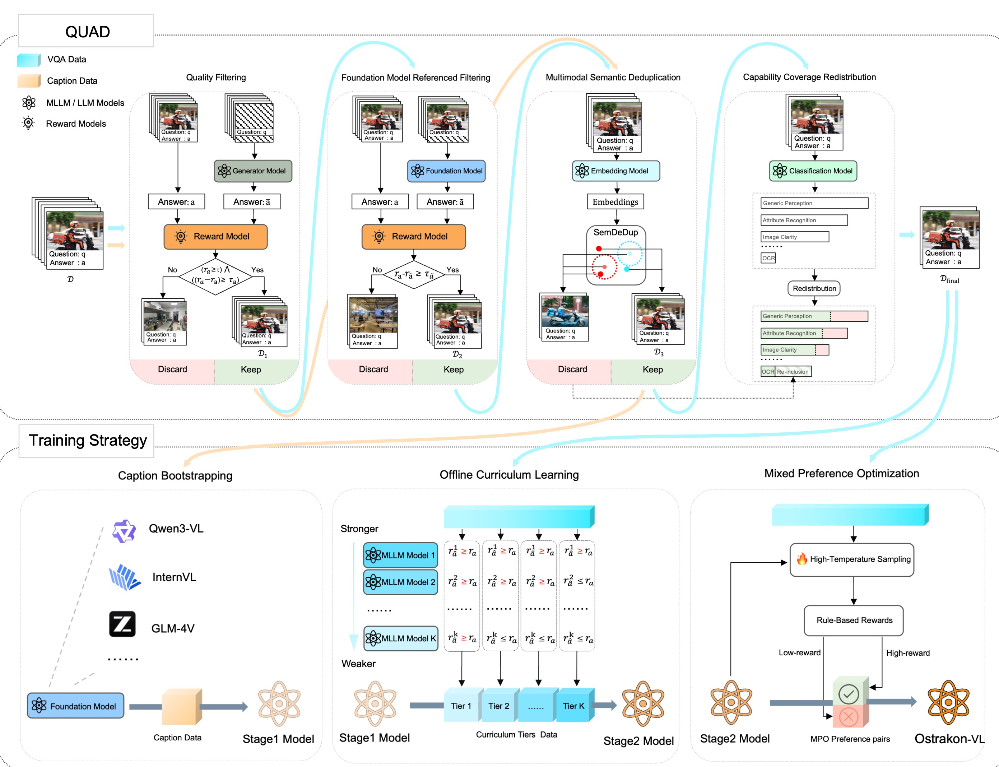
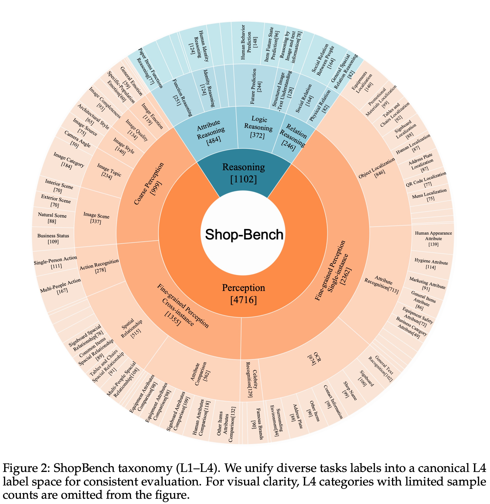
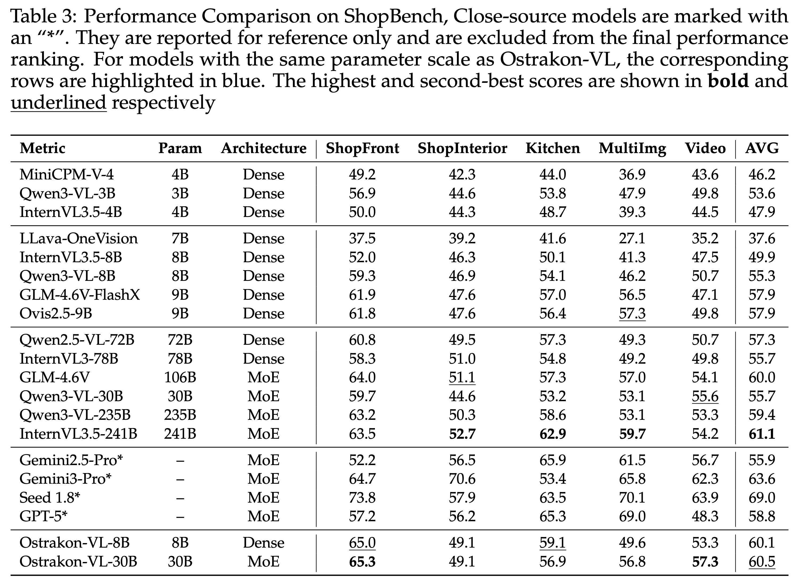
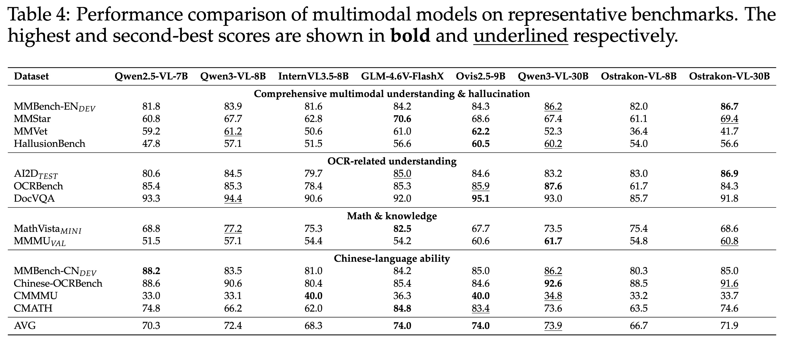

# Ostrakon-VL: Towards Domain-Expert MLLM for Food-Service and Retail Stores


[](https://huggingface.co/Ostrakon/Ostrakon-VL-8B)
[](https://www.modelscope.cn/models/Ostrakon/Ostrakon-VL-8B)
[](https://arxiv.org/abs/2601.21342)
[](LICENSE)




## Introduction

**Ostrakon-VL** is the first open-source Multimodal Large Language Model (MLLM) specifically designed for **Food-Service and Retail Store (FSRS)** scenarios. Built on **Qwen3-VL-8B**, it delivers state-of-the-art performance in real-world retail perception, compliance, and decision-making tasks — outperforming even much larger general-purpose models like Qwen3-VL-235B.

> 🔥 **Key Highlights**
>
> - **60.1 average score** on ShopBench — **+4.8** over Qwen3-VL-8B and **+0.7** over Qwen3-VL-235B  
> - **ShopBench**: First public benchmark for FSRS, with multi-format inputs and diagnostic metrics  
> - Model weights are open-sourced

---

## 📦 What’s Included

- ✅ **[Ostrakon-VL](https://huggingface.co/Ostrakon/Ostrakon-VL-8B)**: A fine-tuned 8B dense MLLM for FSRS
- 🧪 **ShopBench**: The first public benchmark for FSRS, featuring:
  - **Scenarios**: ShopFront, ShopInterior, Kitchen
  - **Input Types**: Single image, multi-image, video
  - **Output Formats**: Open-ended QA, structured Format, MCQ
  - **Unique Design**: High visual complexity (13.0 objects/image), fine-grained task taxonomy (79 categories), and diagnostic metrics (VNR/VIF) to minimize language bias

---

## 🧪 ShopBench: The First Public Benchmark for FSRS



**ShopBench** is the first standardized evaluation suite specifically designed for the **Food-Service and Retail Store (FSRS)** domain. Unlike general-purpose multimodal benchmarks, ShopBench addresses the unique challenges of real-world retail environments:

- **Multi-format Inputs**: Unifies evaluation across **single-image**, **multi-image**, and **video** scenarios under a consistent protocol.
- **Fine-grained Taxonomy**: Organizes tasks into a 4-level hierarchy covering perception (e.g., OCR, object localization) and reasoning (e.g., spatial relations, compliance rules), with **79 leaf-level categories**.
- **Real-world Complexity**: Features the **highest instance density** (13.0 objects/image) among major benchmarks, reflecting cluttered retail scenes.
- **Reduced Language Bias**: Employs diagnostic metrics like **Visual Necessity Rate (VNR)** and **Vision-Induced Failure (VIF)** to ensure questions truly require visual understanding, not just language priors.
- **Domain Distinctiveness**: t-SNE visualization shows ShopBench occupies a **distinct region** in the visual embedding space compared to existing benchmarks (e.g., MMBench, OCRBench).

ShopBench enables fair, interpretable, and actionable comparison of MLLMs in realistic FSRS workflows — from storefront compliance checks to kitchen hygiene audits.

Due to legal reasons, the open-sourcing of ShopBench has been postponed.

---

## 📊 Evaluation Results

### ShopBench Performance (Higher is better)



> Ostrakon-VL achieves 60.1 on ShopBench, outperforming Qwen3-VL-235B (59.4) and its base model Qwen3-VL-8B (55.3).

### General Benchmarks



While specialized for FSRS, Ostrakon-VL maintains reasonable general multimodal ability (e.g., 88.5 on Chinese-OCRBench), demonstrating effective **domain adaptation without catastrophic forgetting**.

---

## 🧠 Training Strategy

Ostrakon-VL is trained via a **multi-stage training strategy**:

1. **Caption Bootstrapping (CB)** – Inject domain knowledge using dense, evidence-rich captions.
2. **Offline Curriculum Learning (OCL)** – Train from easy to hard samples based on difficulty stratification.
3. **Mixed Preference Optimization (MPO)** – Align responses using preference pairs of correct vs. plausible-but-wrong answers.

This strategy enables robust, auditable, and rule-compliant reasoning in complex retail environments.

---

## 🚀 Quick Start

Install dependencies and run inference with just a few lines of code:

```bash
pip install torch transformers accelerate
```
### Inference Example

```python

from transformers import Qwen3VLForConditionalGeneration, AutoProcessor
from PIL import Image

# Load Ostrakon-VL
model = Qwen3VLForConditionalGeneration.from_pretrained(
    "Ostrakon/Ostrakon-VL-8B",
    dtype="bfloat16",
    device_map="auto",
)
processor = AutoProcessor.from_pretrained("Ostrakon/Ostrakon-VL-8B")

def process_local_image(image_path):
    image = Image.open(image_path)
    image = image.resize((512,512))
    return image

image_path = "path/to/img.jpg"
image = process_local_image(image_path)

messages = [
    {
        "role": "user",
        "content": [
            {
                "type": "image",
                "image": image
            },
            {
                "type": "text",
                "text": "图片中的店铺名是什么？"
            }
        ]
    }
]

inputs = processor.apply_chat_template(
    messages,
    tokenize=True,
    add_generation_prompt=True,
    return_dict=True,
    return_tensors="pt"
)
inputs = inputs.to(model.device)

generated_ids = model.generate(**inputs, max_new_tokens=128)
generated_ids_trimmed = [
    out_ids[len(in_ids) :] for in_ids, out_ids in zip(inputs.input_ids, generated_ids)
]
output_text = processor.batch_decode(
    generated_ids_trimmed, skip_special_tokens=True, clean_up_tokenization_spaces=False
)[0]
print(output_text)
```

## 📚 Citation

If you find Ostrakon-VL or ShopBench useful in your research, please cite our paper:

    @article{shen2026ostrakon,
      title={Ostrakon-VL: Towards Domain-Expert MLLM for Food-Service and Retail Stores},
      author={Shen, Zhiyong and Zhao, Gongpeng and Zhou, Jun and Yu, Li and Kou, Guandong and Li, Jichen and Dong, Chuanlei and Li, Zuncheng and Li, Kaimao and Wei, Bingkun and others},
      journal={arXiv preprint arXiv:2601.21342},
      year={2026}
    }

---

## 🤝 Contributing & License

We welcome contributions! Please open an issue or submit a PR.

- **Code & Model**: Apache 2.0 License  

